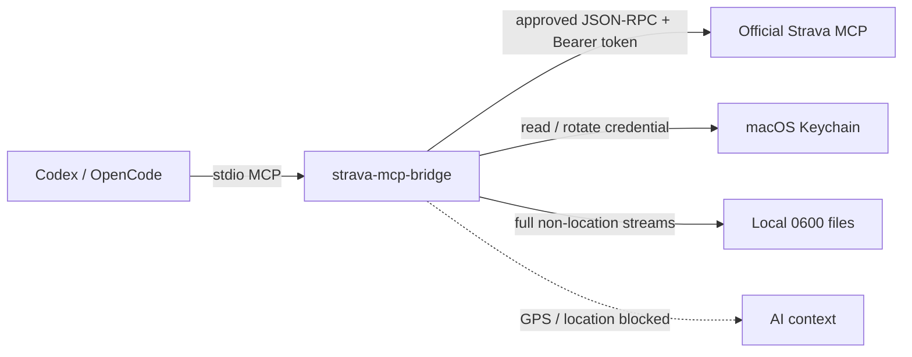

# strava-mcp-bridge

[](https://github.com/millerchou/strava-mcp-bridge/actions/workflows/ci.yml)
[](LICENSE)

**Use Strava's official MCP from Codex, OpenCode, and other local stdio MCP
clients without creating your own Strava developer app.**

The bridge runs locally on Apple Silicon macOS. Its OAuth credential is kept in
macOS Keychain, large activity streams stay in local files, and GPS/location
data is blocked before it can enter the AI context.


## What It Enables

Once connected, a local coding agent can use Strava data as part of a real
project workflow instead of working from copied summaries or synthetic data.

```text
You: Pull my new rides since the local watermark and rebuild my training dashboard.

Codex:
  3 new rides found through the official Strava MCP
  full activity streams saved locally, omitted from model context
  training summary and fitness chart rebuilt
  no GPS, location, or polyline fields returned to the conversation
```

Other example tasks:

- "Compare heart-rate load across my rides this week."
- "Fetch the non-location streams for this activity and update my analysis."
- "Use my latest cycling data to refresh the PMC/TRIMP dashboard in this repo."

The bridge supplies the safe Strava connection. Your agent can then combine the
result with local scripts, notebooks, dashboards, or training-analysis code.

## Why This Exists

Strava publishes an [official MCP connector](https://support.strava.com/en-us/articles/15401531-strava-mcp-connector),
but its documented first-time authorization flow currently targets Claude
clients. Codex supports MCP, yet it cannot currently complete this Strava OAuth
bootstrap directly.

`strava-mcp-bridge` fills that gap:

1. You authorize the official Strava MCP once through Claude Code.
2. You explicitly run `strava-mcp-bridge bootstrap`.
3. The bridge migrates the authorized credential into its own Keychain item.
4. It maintains the rotating refresh-token chain and forwards approved MCP
   requests to `https://mcp.strava.com/mcp`.
5. Normal Codex/OpenCode use no longer reads or invokes Claude Code.

This is not a Strava REST API wrapper and does not provide shared credentials or
bypass user authorization.

## Choose The Right Path

| Path | Create your own Strava app? | Credential custody | Strava interface | Main tradeoff |
|---|---:|---|---|---|
| Official connector in Claude | No | Official client | Official Strava MCP | Simplest if Claude already fits your workflow |
| Community self-hosted Strava MCP | Usually yes | Local | Strava REST API | Broad client support, but you own the app and OAuth plumbing |
| Managed connector | Usually no | Third-party service | Provider-managed API/MCP | Easy setup, but credentials and activity data pass through another service |
| **strava-mcp-bridge** | **No** | **Local macOS Keychain** | **Official Strava MCP** | One-time Claude Code bootstrap; Apple Silicon macOS only |

Managed connector behavior varies by provider. Review its data path and terms
before connecting fitness data.

## Good Fit / Not A Fit

Use this bridge when all of these are true:

- You use Codex, OpenCode, or another client that can run local stdio MCP
  servers.
- You have access to Strava's official MCP through an eligible Strava
  subscription.
- You do not want to create and maintain a Strava developer app.
- You prefer local credential custody and conservative data controls.
- You are on an Apple Silicon Mac.

Use another path when any of these are true:

- Claude's official connector already covers your workflow.
- Creating a Strava developer app is acceptable and you want a conventional
  REST API integration.
- Your source of truth is Garmin, Intervals.icu, Apple Health, or another system.
- You need Linux, Windows, or Intel Mac support.
- You do not have an eligible Strava subscription.

## Requirements

- Apple Silicon macOS (`darwin arm64`)
- Node.js 22+
- Xcode Command Line Tools (`xcode-select --install`)
- An eligible Strava subscription
- One successful official Strava MCP authorization in Claude Code

A paid Claude subscription is not required by this bridge. The authorization
has also been validated with Claude Code launched through Ollama; the important
component is the Claude Code OAuth client, not the model backend.

## Install

```bash
npm install -g strava-mcp-bridge
```

Install the bundled Codex skill explicitly at user scope:

```bash
strava-mcp-bridge skill install
```

This writes only to `$HOME/.agents/skills/strava-mcp-bridge`; it does not edit
Codex or MCP configuration. To keep the skill inside one project instead:

```bash
strava-mcp-bridge skill install --project-dir /absolute/path/to/project
```

Start a new Codex task after installation, then invoke
`$strava-mcp-bridge`. Existing different skill content is never overwritten
unless you review the target and pass `--force` explicitly.

### 1. Authorize The Official Strava MCP Once

Add the official endpoint to Claude Code:

```bash
claude mcp add --transport http strava https://mcp.strava.com/mcp
```

Inside Claude Code, run `/mcp`, select `strava`, and complete the Strava browser
authorization. This is the only step that needs Claude Code.

### 2. Bootstrap The Local Bridge

```bash
strava-mcp-bridge bootstrap
```

`bootstrap`:

- builds the native Keychain helper when needed;
- imports and claims the authorized refresh-token chain;
- stores the bridge-owned credential in macOS Keychain;
- prints a project-scoped Codex MCP configuration snippet;
- never prints token values.

Add the generated snippet to the target project's `.codex/config.toml`, restart
Codex (or start a new task), then call `health` before enabling activity tools.

For a training sync configuration:

```bash
strava-mcp-bridge config codex \
  --profile training-sync \
  --stream-output-dir /absolute/path/to/your/project/strava-streams
```

The generated profile exposes:

- `health`
- `eligibility`
- `list_activities`
- `get_activity_streams`
- `get_activity_performance`

The bundled [Codex skill](.agents/skills/strava-mcp-bridge/SKILL.md) guides the
agent through `doctor`, `bootstrap`, project-level configuration, and safe
failure handling. A source checkout exposes it as a repository skill; the
`skill install` command makes it discoverable from other projects.

## How It Works



The bridge is both a transport adapter and a local policy boundary:

- remote Streamable HTTP MCP is presented as a local stdio MCP server;
- `tools/call` is denied unless its tool name is explicitly allowlisted;
- `tools/list` is filtered to the local allowlist;
- access tokens are sent only to the pinned official MCP endpoint by default;
- OAuth refresh uses the pinned Strava token endpoint and MCP resource;
- MCP sessions are reinitialized after expiry and deleted on stdio shutdown.

## Privacy Defaults

### Location Data

`get_activity_streams` requires an explicit stream list. The accepted streams
are:

```text
time, heart_rate, velocity_smooth, cadence, altitude,
distance, temp, watts, grade_smooth, moving
```

Location/GPS/polyline-like streams are rejected before forwarding. Other
structured tool responses are recursively redacted for common location keys,
coordinate text, coordinate arrays, polylines, maps, and token-like fields.
Opaque non-JSON text and non-text content blocks fail closed.

### Large Streams

Full stream arrays are never returned to the MCP client context. They are
written atomically to a current-user-owned directory (`0700`) as regular files
with mode `0600`. The tool result contains only the path, stream names, point
counts, and `omitted_from_context=true`.

Default location:

```text
~/Library/Application Support/strava-mcp-bridge/streams/
```

Retention cleanup is a dry run unless `--yes` is supplied:

```bash
strava-mcp-bridge streams prune --older-than-days 30
strava-mcp-bridge streams prune --older-than-days 30 --yes
```

See [SECURITY.md](SECURITY.md) and [THREAT_MODEL.md](THREAT_MODEL.md) for the
complete controls and residual risks.

## Credential Lifecycle

The bridge-owned Keychain item is:

```text
Strava MCP Bridge Native-credentials
```

The explicit import is a credential ownership migration, not a passive copy.
Strava refresh tokens rotate, so claiming the chain for bridge-owned operation
can make Claude Code's previous copied refresh token stale. Claude Code can
reauthorize later if it needs its own connection again.

Normal MCP startup reads only the bridge-owned Keychain item. It does not import
from Claude Code or modify Claude Code configuration.

### Keychain Permission Dialogs

During `bootstrap`, macOS may show two different prompts:

- `/usr/bin/security` reading `Claude Code-credentials`: choose **Allow**, not
  **Always Allow**. This is the explicit one-time import.
- `strava-keychain-helper` reading the bridge-owned item: **Allow** is the
  least-privilege choice. **Always Allow** avoids repeat prompts but accepts the
  documented same-user helper risk.

A rebuilt helper may trigger a new prompt after an upgrade.

## Useful Commands

| Command | Purpose |
|---|---|
| `strava-mcp-bridge doctor` | Read-only platform/helper/credential check |
| `strava-mcp-bridge bootstrap` | Set up helper, credential, and config snippet |
| `strava-mcp-bridge auth status --json` | Show non-sensitive credential metadata |
| `strava-mcp-bridge skill install` | Install the bundled Codex skill at user scope |
| `strava-mcp-bridge skill install --project-dir <path>` | Install it in one project |
| `strava-mcp-bridge config codex --profile minimal` | Print minimal Codex config |
| `strava-mcp-bridge config codex --profile training-sync` | Print cycling-sync config |
| `strava-mcp-bridge streams prune --older-than-days 30` | Preview stream retention cleanup |
| `strava-mcp-bridge auth remove` | Preview bridge credential removal |
| `strava-mcp-bridge auth remove --yes` | Delete only the bridge-owned credential |

See `strava-mcp-bridge --help` for endpoint, timeout, data-directory, and
diagnostic override options.

## Removing Access

```bash
strava-mcp-bridge auth remove          # dry run
strava-mcp-bridge auth remove --yes    # remove local bridge credential
```

This never removes Claude Code's credential. To revoke access on Strava's side,
deauthorize the connection in Strava's connected-app settings.

## Current Status

- Experimental `0.1.x`
- Apple Silicon macOS only
- Official Strava MCP, not a REST API reimplementation
- First OAuth bootstrap still requires Claude Code
- No verified standards-only dynamic client registration path exists today
- Official MCP Registry metadata is prepared; publication waits for the first
  npm release
- Strava [says support for other clients is planned](https://support.strava.com/en-us/articles/15401526-strava-api-and-mcp-faq)

The restriction appears at OAuth client registration/token issuance, not at the
LLM model or a simple User-Agent check. Generic RFC 7591 registration attempts
were rejected during isolated testing.

## Development

```bash
npm test
npm run build:keychain-helper
npm pack --dry-run
```

Tests use local mocks. They do not contact Strava or read Keychain.

Release-owner instructions are in
[RELEASING.md](https://github.com/millerchou/strava-mcp-bridge/blob/main/RELEASING.md).

## Disclaimer

This is an unofficial community project. It is not affiliated with or endorsed
by Strava, Anthropic, OpenAI, or the OpenCode maintainers. Strava can change its
OAuth, MCP, subscription, or client-support behavior at any time.
